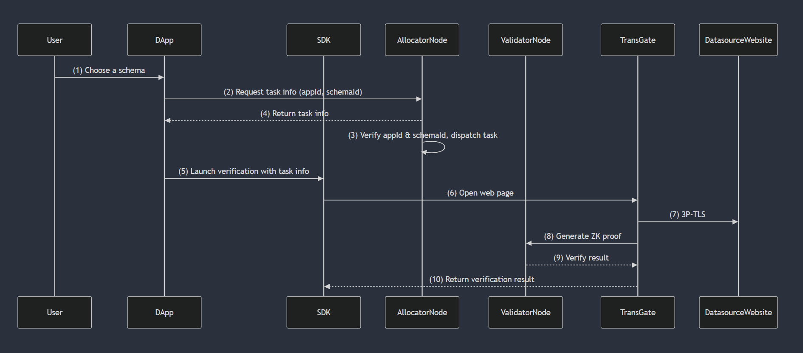
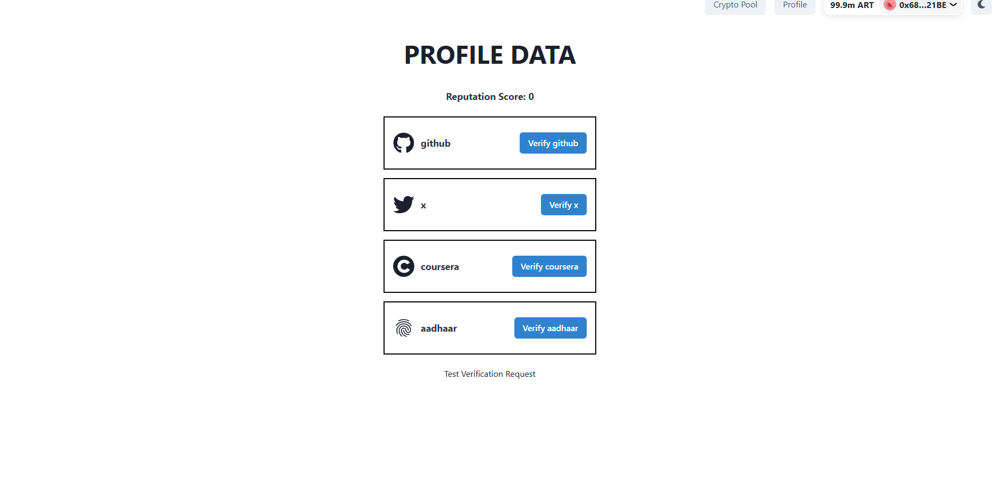

# Proof of Trust

## Overview

Proof of Trust is a decentralized identity verification platform that enables users to authenticate various online and real-world identities. It leverages **Rollkit** and **Artela EVM++** for efficient execution, ensuring security, transparency, and reliability. Each verified user receives a **Soulbound NFT (SBT)**, containing a **reputation score** based on their authenticated accounts.



## How It Works

1. **User Verification:** <br>
   Users can connect their accounts (Twitter, Coursera, Aadhaar, etc.) to the Proof of Trust Portal for verification. The portal utilizes zkPass to generate cryptographic proofs entirely on the client side, ensuring privacy and security.Once the proof is generated, users can submit and verify it on-chain, enabling trustless and tamper-proof authentication. This approach guarantees that sensitive user data remains private while still proving the validity of their credentials. 🚀

2. **Reputation Score Calculation:** <br>
   The **Proof of Trust Portal** assesses the authenticity of users' connected accounts (**Twitter, Coursera, Aadhaar, etc.**) and assigns a **trust score** based on the verification results. This score represents the user's credibility within the ecosystem and can be utilized by **dApps, decentralized identity systems, and trust-based applications**.

   Currently, the **trust score is manually set within the smart contract**, meaning administrators define the score based on verified credentials. Future enhancements will introduce **automated, dynamic scoring mechanisms**, leveraging **on-chain and off-chain data sources** to make the process more **scalable, transparent, and decentralized**. 🚀

3. **Soulbound NFT Issuance:** <br>
   In the **Proof of Trust Portal**, a **non-transferable NFT (Soulbound Token)** is minted after users verify their identity via **zkPass**. This NFT permanently stores the **user’s trust score**, reflecting the authenticity of their connected accounts (**Twitter, Coursera, Aadhaar, etc.**).

   ### **Key Features:**

   - **Immutable & Tamper-Proof:** The NFT is **permanently linked** to the user’s wallet, ensuring credibility.
   - **Decentralized Identity:** Used by **dApps and smart contracts** for reputation-based access.
   - **Non-Transferable:** Cannot be sold or moved, preserving the integrity of the trust score. <br>
     Future updates may enable **dynamic scoring**, allowing trust levels to evolve over time. 🚀

4. **Integration with dApps:** <br>
   Third-party applications can integrate Proof of Trust to verify user credibility and ensure secure, trust-based interactions. This enables dApps, identity platforms, and decentralized services to authenticate users without relying on centralized authorities.



The **frontend** consists of two main pages:

1. **Profile Page:** Users can **verify their social accounts** (e.g., Twitter, Coursera) through **zkPass**, proving their credentials on-chain.
2. **Crypto Pool Page:** This page includes a **reputation-based reward example**, demonstrating how trust scores influence user benefits.

### **Proof of Claim Example:**

- Users must complete **two verification tasks**:  
  ✅ Verify Twitter follower count **greater than 15**  
  ✅ Verify enrollment in **Coursera’s Cryptography 1 course**
- Once both tasks are completed and the **user’s reputation score > 0**, they can **claim a $1 reward** as proof of trust-based incentives.

This setup highlights how **reputation-based rewards** can be integrated into decentralized applications, encouraging verified and trusted interactions. 🚀

## Features

- **Decentralized Identity Verification:** Users can verify accounts like **Twitter, Coursera, Aadhaar**, and more.
- **Soulbound NFT:** Each user receives a non-transferable NFT representing their **verified identity and reputation**.
- **Trust Score System:** Reputation is determined based on verified accounts.
- **dApp Integration:** Developers can build applications leveraging verified identities.

## Use Cases

- **Web3 Identity Management:** Users can prove their credibility without sharing sensitive data.
- **On-Chain Reputation Systems:** dApps can integrate Proof of Trust for gated access based on reputation.
- **Decentralized Finance (DeFi):** Platforms can assign risk scores based on verified identities.
- **Gaming & Metaverse:** Players can establish credibility based on verified social and educational accounts.

## Technology Stack

- **Blockchain Execution:** Rollkit + Artela EVM++
- **Smart Contracts:** Solidity-based identity and reputation management
- **Soulbound NFTs:** ERC-721 non-transferable tokens for verified identities

## Getting Started

### 1. Aretla EVM++

First, we need to set up **Artela EVM++ with Rollkit** to establish the foundational infrastructure for **Proof of Trust**. This setup enables **modular execution**, **scalability**, and **efficient task verification**.

To get started, follow the official documentation:  
🔗 [Artela EVM++ with Rollkit Setup Guide](https://rollkit.dev/tutorials/execution/artela-evm-plus-plus)

This configuration ensures a **trustless, high-performance** execution layer, allowing seamless **proof validation and verification** within the **Proof of Trust** ecosystem. 🚀

### 2. Install Dependencies

```sh
cd frontend
yarn install
```

### 3. Deploy Smart Contracts

I deployed the contracts using **Remix IDE** while running **Rollkit** in a **Docker** environment. The **RPC endpoint** is available at `http://localhost:8545`.

To interact with the deployed contracts in **Remix IDE**, follow these steps:

1. Open **Remix IDE**.
2. Navigate to the **Deploy & Run Transactions** tab.
3. Change the environment to **Dev - Foundry Provider**.
4. From there, users can easily **deploy and interact with the contract**.

This setup ensures a smooth development workflow for testing and deploying smart contracts on **Rollkit with Artela EVM++**. 🚀

### 4. Run the dApp

```sh
 yarn dev
```
